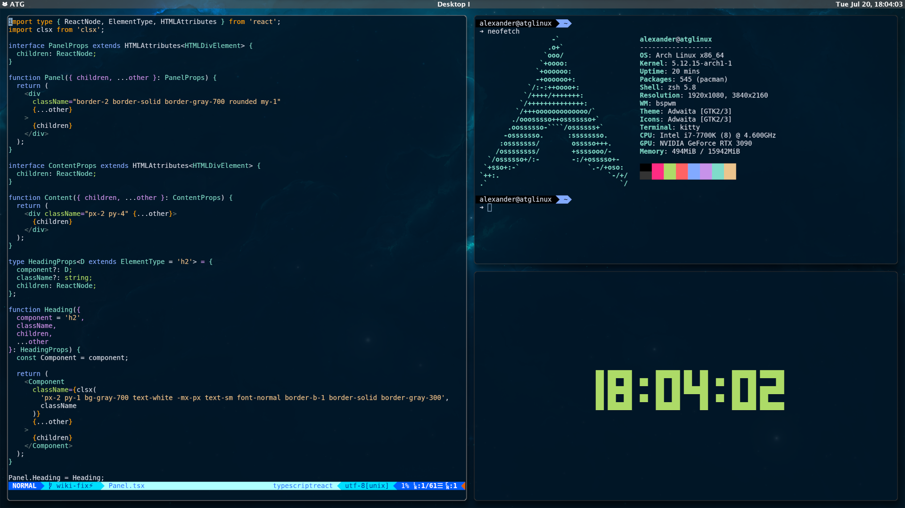
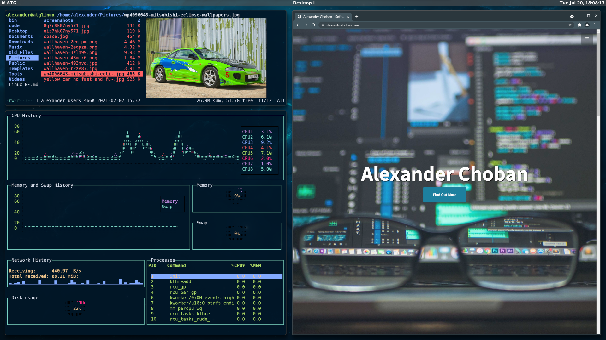
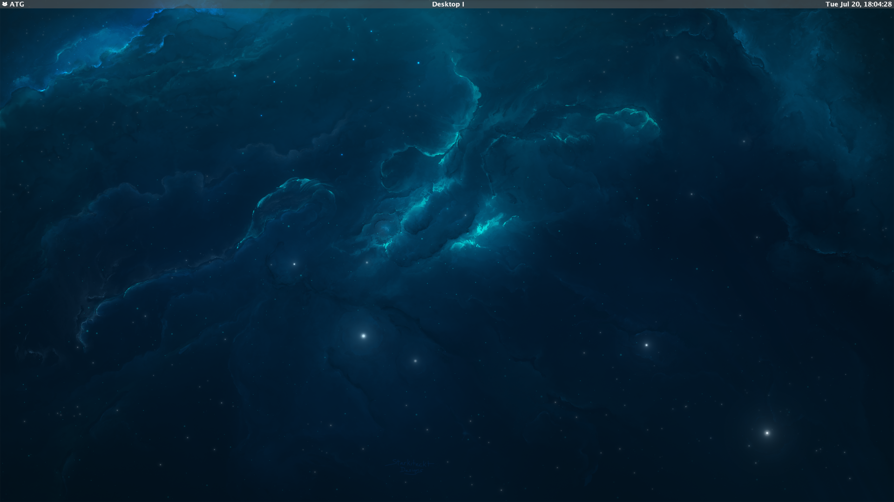

# dotfiles

My personal dotfiles for Arch Linux

## Window Environment

* bspwm-rounded-corners-git
* lemonbar
* picom

## Software

* vim
* gtop
* ranger
* tty-clock
* mpv
* kitty
* chromium
* nitrogen
* neofetch
* remmina 

## Fonts

* Lucida Grande
* Lucida Console
* Hack Nerd Font

## Screenshots

